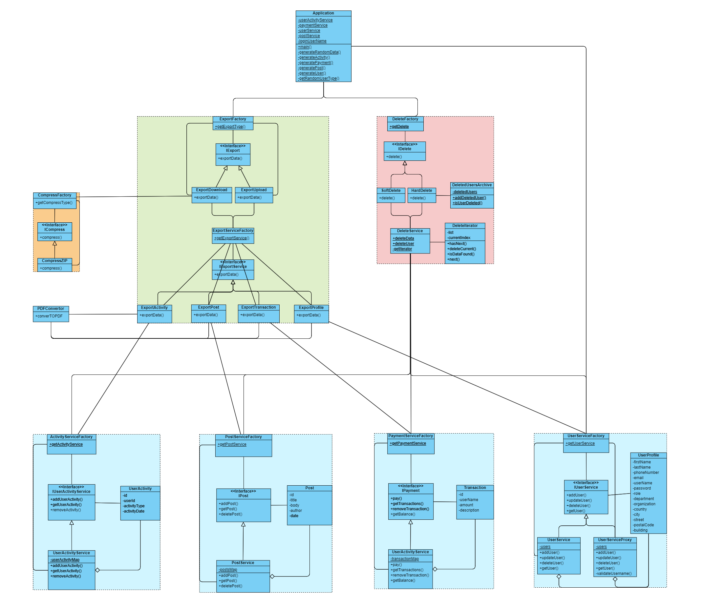

# AdvancedProjectTeam15

This project represents a component of a larger application.
This component has 2 main functionalities:
1. Export user data from data services
2. Delete user data from data services

## Export
So we made adding exporting methods easy, but at start we have only two methods, 1 implemented and 1 waiting to be implemented.
The implemented method is the one that downloads the data to the user's device.
Firstly, the function calls the export method for each service, each service stores the data as a text file then calls the PDFConvertor to convert the text files into PDF files.
After that, the function calls the zip method to zip all the PDF files into one zip file.

This method takes 2 parameters:
1. The username of the user that wants to export his data, of course it considers the user's powers.
2. The path of the folder that the user wants to download his data to.

So we made adding exporting methods easy by implementing the factory design pattern, that also applies for the export methods for each service, which makes adding a new services to the system requires the minimum amount of changes ,also we considered that there are more than one type of compression, so we made the compression method as a factory design pattern, so we can add more compression methods easily.

You can find the result in the directory called "output" in the src directory.
## Delete
We have two types of delete methods.
1. Hard delete: which deletes all the user's data including the user's account, it also prevents creating a new account using the deleted account's username, this was implemented by adding the deletedUserArchive class.
2. Soft delete: which deletes all the user's data except the user's account.

We also made adding deleting methods easy by implementing the factory design pattern.
We used the iterator design pattern to iterate over some services' data to preform clean delete to avoid any errors.

## Using Services
So we noticed that every service has its own interface, this gave us a sign that the system expects adding more services for the service family in the future.
This is why we added a factory for each service and used it in our system without touching the services themselves.
We also noticed that the user profile service didn't consider two important thins:
1. Adding or updating a user with a blank username.
2. Adding or updating a user with a username that has been hard deleted.
3. Adding or updating a user with a username that already exists, since it stores in a hash map, so it will overwrite the old user without even notifying.

And since we don't want to modify the user profile service, we used the proxy design pattern to create proxy user profile service that handles the previous cases as follows:
1. Overriding the add and update methods to throw BlankUsernameException if the username is blank.
2. Overriding the add and update methods to throw UserDeletedException if the username is in the deleted users archive.
3. Overriding the add method to throw UserAlreadyExistsException if the username already exists.

## Exceptions
We tried our best to handle any expected exceptions and avoid any unexpected behavior.

* Built-in Exceptions: we handled each as it should be handled.

* Services exceptions: we handled the exceptions that may occur in the services, mainly:
  * UserNotFoundException, BadRequestException: we handled them by keep throwing them until they reach the application function, since the application function is the one responsible for the wrong input.
  * SystemBusyException: We handled it by retrying the request until it succeeds.

* Custom Exceptions: we found that in some scenarios build in exceptions where not suitable, so we created our own:
  * BlankUsernameException: we throw it when the user tries to add or update a user with a blank username.
  * FileDeleteException: we throw it when the system fails to delete a file during the export operation.
  * UnqualifiedUserException: we throw it when the user tries to export data that he is not qualified to export.
  * UserAlreadyExistsException: we throw it when the user tries to add a user with a username that already exists.
  * UserDeletedException: we throw it when the user tries to add or update a user with a username that has been hard deleted.

## Logging
Logging makes everything easier, so adding logging to our system was a must.
To make it easier, we created our own logger class that handles all the logging operations and stores the logs in a text file in the "out/production/AdvancedProjectTeam15/edu/najah/cap/logs" directory.
This way, we can easily change the logging options in one place.
Other methods can use the logger by calling the static method "log" in the logger class.

## Conclusion
We mainly used the following design patterns:
* Factory design pattern: to make the system more flexible and easier to add new services, export methods, delete methods, and compression methods.
* Proxy design pattern: to enhance the user profile service by handling some cases that the user profile service didn't handle without modifying the user profile service itself.
* Iterator design pattern: to iterate over some services' data to preform clean delete to avoid any errors.
* Singleton design pattern: we combine the singleton design pattern with the proxy design pattern to enhance the performance of the system by creating only one instance of the user profile service in the proxy user profile service.

## Class Diagram
